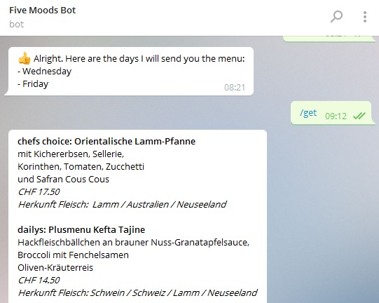

# SV restaurant zug bot (@FiveMoodsBot)

[](https://travis-ci.org/Sirius-A/sv-restaurant-zug-bot) 

A Telegram bot to retrieve the menu of the SV restaurant in Zug (called Five Moods).


# Try it 
Add the bot using http://telegram.me/FiveMoodsBot and call `/get@FiveMoodsBot` to receive today's menu.

If you want the bot to send you the menu regularly, try  `/getDaily@FiveMoodsBot` or `/getPartTime@FiveMoodsBot`.

# Develop
1. To host a similar bot like this, clone this repo:

    ```
    $ git clone git@github.com:Sirius-A/sv-restaurant-zug-bot.git
    ```

2. Install all packages with

    ```
    $ yarn
    ```

3. To start the bot you will need an Telegram API token. Talk to the [BotFather](https://telegram.me/BotFather) for that.
    Once you received your token, pass to the `BOT_API_TOKEN` environment variable. 
    This can be done in the run config of your IDE or directly in the console.

    ```
    $ BOT_API_TOKEN='MY_SUP3R:SEC|2ET_4PI_T0K3N' yarn start
    ```
    **Note:** This bot also uses 2 more environment variables.
     - `MONGODB_URI` as a connection string to mongoDB, where the subscriptions are stored.
     - `BOT_USERNAME` the username of the bot, used to add its handle when listing the bot command.

5. Once you’re satisfied with the behavior, commit all your files and deploy the app to a node.js provider of your choice.
Below are the steps required for [Heroku](https://www.heroku.com).

    ```
    $ heroku create five-moods-telegram-bot --region eu
    Creating five-moods-telegram-bot... done, region is eu
    
    $ heroku config:set BOT_API_TOKEN=MY_SUP3R:SEC|2ET_4PI_T0K3N
    Setting BOT_API_TOKEN and restarting five-moods-telegram-bot... done, v6
    
    $ heroku git:remote -a five-moods-telegram-bot
    
    $ git push heroku main
    ```

6. Run the following command to avoid the error log message `Error R10 (Boot timeout) -> Web process failed to bind to $PORT within 60 seconds of launch`:

    ```
    $ heroku scale web=0 worker=1
    ```


## Credits and Thanks
 * [Roman Blum](https://github.com/rmnblm/) for creating the [hsr-lunchbot](https://github.com/rmnblm/HSR-LunchBot), which was used as a starting point for this project.
 * [Gocho Mugo](https://github.com/GochoMugo) and [Yago_Perez](https://github.com/yagop) for their [node telegram api](https://github.com/GochoMugo/tgfancy) .
 * You for using this bot and thereby giving it a purpose in its ~~life~~ operation :heart:.
 
## Disclaimer
This bot (and I :stuck_out_tongue_winking_eye:) are not affiliated with SV Groups in any way. This bot is not officially supported by SV.